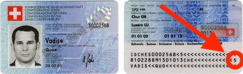
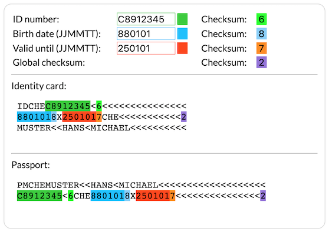

# swiss-id-checksum

Calculation of Swiss ID and passport checksums.

### [Live Demo](https://akleemans.github.io/swiss-id-checksum/)

For german version, see [this blog post](https://www.kleemans.ch/identitaetskarte-berechnung-pruefziffer).
